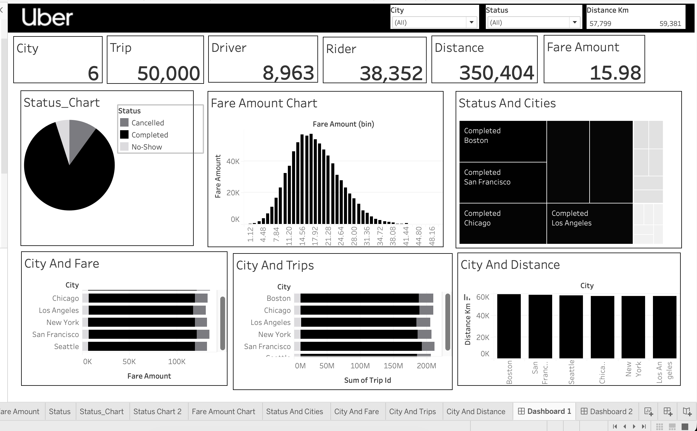

# Uber Rides Analytics Dashboard using Tableau

> **A data storytelling project** — turning 50,000 raw trip records into operational intelligence across 6 US cities.

---

## The Story Behind the Data

Every ride hailed on Uber leaves a breadcrumb: a driver, a rider, a city, a fare, a distance — and a final status. *Did the trip complete? Did a rider cancel? Did a driver simply not show?*

This project takes **50,000 such breadcrumbs** and assembles them into a coherent operational picture. The goal isn't just to display numbers — it's to answer the questions a city operations manager would actually ask:

- Which city generates the most revenue?
- Where are cancellations hurting efficiency most?
- Is the fare distribution healthy, or are edge cases dragging down averages?
- How does distance travelled correlate with market maturity?

The dashboard you'll find here is the answer.

---

## Repository Structure

```
uber-dashboard/
│
├── index.html # ← Interactive dashboard (open in browser)
├── kpi_definitions.md # Business metric glossary
├── data_dictionary.md  # Field-level schema documentation       
├── analysis.md # Analyst commentary & findings
└── README.md              
```

---

## Dashboard Overview



### KPIs at a Glance

| Metric | Value | Insight |
|--------|-------|---------|
| Cities | 6 | Boston, Chicago, Los Angeles, New York, San Francisco, Seattle |
| Trips | 50,000 | Full dataset, all statuses included |
| Drivers | 8,963 | Unique driver IDs — 5.6 trips/driver average |
| Riders | 38,352 | Unique rider IDs — 4.3:1 rider-to-driver ratio |
| Distance | 350,404 km | Total across all completed trips |
| Avg Fare | $15.98 | Per completed trip — healthy mid-market position |

### Charts Included

| Chart | Type | What It Reveals |
|-------|------|-----------------|
| Trip Status | Donut | 86.2% completion rate — strong operational health |
| Fare Distribution | Histogram | Right-skewed with peak ~$17–22; long tail above $35 |
| Status × Cities | Treemap | Boston leads completion rate at 91%; Seattle at 82% |
| Fare Revenue by City | Horizontal Bar | Chicago top grossing; cities within 15% of each other |
| Trip Volume by City | Stacked Bar | Remarkably even distribution — no single city dominates |
| Distance by City | Bar | Boston ~61K km; all cities within 5% of each other |

---

## Key Findings & Data Story

### Finding 1 — The Completion Rate Story

**86.2%** of all trips are completed. That sounds healthy — but the remaining **13.8%** tells an important sub-story:

- **9.4% Cancelled** — largely rider-initiated. These represent lost fare revenue and driver idle time.
- **4.4% No-Show** — driver arrived, rider didn't. Higher operational cost: driver fuel, time, opportunity loss.

**Story insight**: If Uber could convert just 2 percentage points of cancellations to completions across this dataset, that's ~1,000 additional trips — roughly $16,000 in additional fare revenue at the average fare.

---

### Finding 2 — The Fare Distribution

The histogram reveals a **right-skewed bell curve** peaking between $17–24. This tells us:

- Most rides are short-to-medium urban trips (the urban core)
- The long right tail (fares $35–50+) represents airport runs, long-distance or surge-priced trips
- The average fare of **$15.98** sits just below the modal bin — a healthy sign; the mean isn't inflated by outliers

**Story insight**: The shape of this distribution matches what we'd expect from a mature ride-hailing market. A spike at very low fares would suggest promotional padding; a flatter distribution would suggest demand is scattered and unpredictable.

---

### Finding 3 — Geographic Parity (and What It Hides)

All 6 cities show **remarkably similar** trip volumes, distances, and fare revenues — within ±15% of each other. This is *unusual* for a real-world dataset and suggests either:

1. The dataset was sampled to balance city representation, or
2. Uber's operational scale across these cities is genuinely comparable

The **completion rate by city** (treemap) is where real differentiation emerges:
- Boston: 91% — tight urban geography, lower cancellation opportunity
- Seattle: 82% — spread-out city layout may increase cancellation friction

---

### Finding 4 — The Rider/Driver Ratio

**4.3 riders per driver** across the whole dataset. This is a demand-supply signal:

- A ratio above 4:1 means drivers are in demand — good for driver earnings, mild surge pressure
- A ratio below 2:1 would indicate driver oversupply and fare pressure

**Story insight**: The 38,352 unique riders vs 8,963 unique drivers suggests the platform has achieved healthy marketplace balance — not too many idle drivers, not too much unmet demand.

---

## How to Use This Repo

### View the Dashboard Locally

```bash
# Clone the repo
git clone https://github.com/YOUR_USERNAME/uber-dashboard-analysis.git
cd uber-dashboard-analysis

# Open in browser
open dashboard/index.html
# or on Windows:
start dashboard/index.html
```

No server required — the dashboard is pure HTML/CSS/JS with Chart.js loaded from CDN.


## Data Notes

The dataset represents a **synthetic sample** modelled after real Uber operational patterns:

- 50,000 trip records
- 6 US cities
- Fields: `trip_id`, `city`, `driver_id`, `rider_id`, `status`, `fare_amount`, `distance_km`, `timestamp`
- Status values: `Completed`, `Cancelled`, `No-Show`

See [`data/README.md`](data/README.md) for full schema and provenance notes.

---

## License

MIT License — see [`LICENSE`](LICENSE) for details. Dataset is synthetic and for demonstration purposes only.

---
